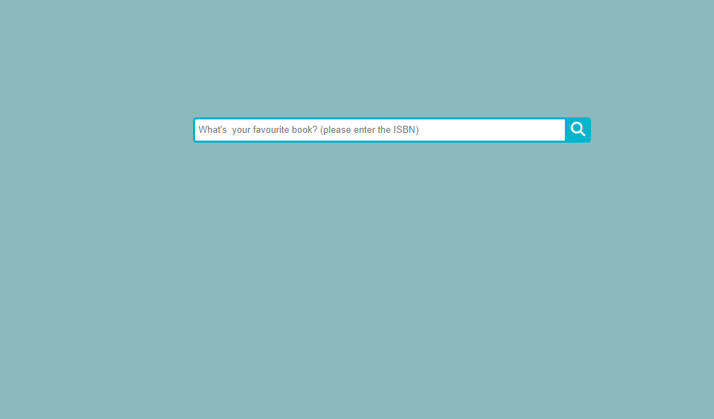
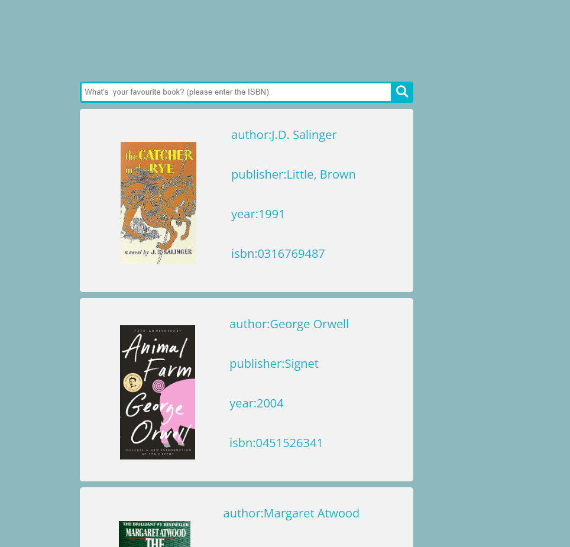

This is a project i build to practice using **django** and **KNN models**.

the model is trained on [book crossing dataset](https://www.kaggle.com/datasets/somnambwl/bookcrossing-dataset) to recommend 5 books you might enjoy based on the isbn of your favourite book. 

here are picture of how it works and how to run it 

how to run this:

open the virtual enviroment 

>`./Scripts/activate` 

then change the direcoty to mysite

>`cd mysite`

then run the server using this command 

>`python.exe  manage.py runserver`

